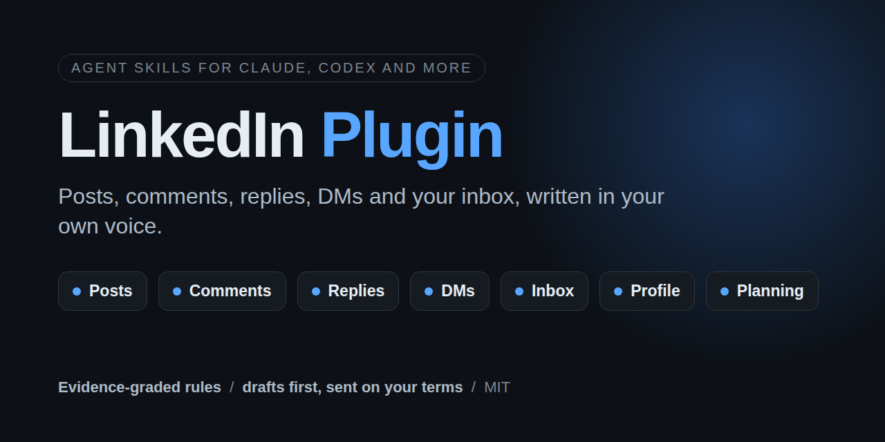

<p align="center">
  
</p>

<h1 align="center">LinkedIn Plugin</h1>

<p align="center">
  <b>Your AI agent, good at all of LinkedIn: posts, comments, replies, DMs and your inbox, written in your own voice.</b>
</p>

<p align="center">
  <a href="LICENSE"></a>
  <a href="https://github.com/rapha-red/linkedin-plugin/stargazers"></a>
  
</p>

Most LinkedIn tools stop at the post. The conversations happen in the comments and the inbox, and that is where
AI-written text gets noticed fastest. This plugin covers the whole loop: it writes posts, comments on the right
posts, answers your comment threads, opens conversations and carries them to an outcome. Every rule cites its
evidence grade or is labelled as practice, and nothing is sent without your approval
unless you switch on autopilot.

## Install

**Claude Code** (recommended)

```
/plugin marketplace add rapha-red/linkedin-plugin
/plugin install linkedin-plugin@linkedin-plugin
```

Verify: type `/linkedin-plugin:linkedin-setup`. The skill starts by asking who you write as.

<details>
<summary><b>Claude Desktop and claude.ai</b></summary>

Customize > Plugins > Add > Add marketplace > From a repository > `rapha-red/linkedin-plugin`, then Discover >
Add. Plugins need a paid plan.

claude.ai on the web has no local files: keep your persona file in a Project's knowledge (setup produces it for
you to paste there), and the conversation log is off there, so follow-ups and suppressions are not remembered
between chats. The Desktop Code tab and Cowork work like Claude Code. To let the skills read and send for you on
claude.ai, see Go further.

Verify: in a new chat, ask "use the linkedin-setup skill". It starts by asking who you write as.
</details>

<details>
<summary><b>Codex</b></summary>

```
codex plugin marketplace add rapha-red/linkedin-plugin
```

Then install `linkedin-plugin` from `/plugins`.

Verify: ask "use the linkedin-setup skill". It starts by asking who you write as.
</details>

<details>
<summary><b>OpenClaw</b></summary>

Newer OpenClaw versions install straight from the repository:

```
openclaw skills install git:rapha-red/linkedin-plugin
```

Otherwise copy the skill folders, all of them side by side:

```
git clone https://github.com/rapha-red/linkedin-plugin
cp -r linkedin-plugin/skills/* ~/.agents/skills/
```

Check `openclaw skills --help` if your version differs. Verify: ask "use the linkedin-setup skill". It starts by
asking who you write as.
</details>

<details>
<summary><b>Hermes</b></summary>

Copy the skill folders, all of them side by side:

```
git clone https://github.com/rapha-red/linkedin-plugin
cp -r linkedin-plugin/skills/* ~/.hermes/skills/
```

Or register the repository as a tap (`hermes skills tap add rapha-red/linkedin-plugin`) and install each skill by
path, for example `hermes skills install rapha-red/linkedin-plugin/skills/linkedin`, keeping all ten.

Check `hermes skills --help` if your version differs. Verify: ask "use the linkedin-setup skill". It starts by
asking who you write as.
</details>

<details>
<summary><b>Cursor, Gemini CLI, Copilot and other SKILL.md agents</b></summary>

With the skills CLI:

```
npx skills add rapha-red/linkedin-plugin
```

Or copy the skill folders yourself. Keep them side by side: the task skills read shared rules from the
`linkedin` skill folder.

```
git clone https://github.com/rapha-red/linkedin-plugin
cp -r linkedin-plugin/skills/* ~/.agents/skills/
```

Verify: ask "use the linkedin-setup skill". It starts by asking who you write as.
</details>

If it saves you time, a star and a watch help others find it and bring you each update.

## Try these

Start with setup once. It takes about ten minutes and everything after sounds like you.

```
Set up my LinkedIn voice. Here are five of my posts and a few DMs I sent.
Turn these meeting notes into a LinkedIn post. Give me three angles first.
Interview me for a post about the worst hire I ever made.
Write a comment on this post: <paste the post>
Find posts from this week worth commenting on, about B2B sales hiring.
Answer the comments on my last post.
Write an opener to this person. We met at a conference last year: <paste the profile>
Go through my inbox and tell me who I owe a reply.
She said "maybe next quarter". What do I answer?
Review my profile headline and About section.
Plan my next week on LinkedIn.
```

## What's inside

| Skill | Modes | What it does |
|---|---|---|
| `linkedin-setup` | quick setup, story bank interview, settings (approval level, `pitch_before_reply`, CRM, language, timezone and hours), refresh voice, add or switch persona | Builds your persona: voice from your own samples, a story bank of facts you are happy to use, off-limits topics, approval level. Several personas supported (you, a second account, a founder you write for). |
| `linkedin-post` | from an idea, interview me, repurpose a source, reuse a structure | Writes a post from an idea, by interviewing you, from a blog or talk, or in the structure of a post you liked. |
| `linkedin-humanize` | rewrite, audit | Rewrites a draft until it sounds like you, or audits it before you post. |
| `linkedin-comment` | draft a comment, reshare with commentary, find posts worth commenting on | Drafts comments that add something, reshares with your take, and finds fresh posts worth joining. |
| `linkedin-reply` | single reply, thread sweep, threads to revisit | Answers comments on your posts and replies to your comments elsewhere. |
| `linkedin-dm` | opener (cold, after they engaged, new connection, warm network, role change), connection note, warm leads | First messages, connection notes, and conversations with people who engaged with your post. |
| `linkedin-inbox` | triage, reply and steer, follow-ups due, close and suppress, handoff | Works existing conversations toward an outcome, follows up when due, closes cleanly. |
| `linkedin-plan` | weekly plan, review of last week, team mode | A weekly plan for posts, comments and conversations, a review from the log, and employee advocacy for a team. |
| `linkedin-profile` | full audit, rewrite one section | Audits and rewrites your headline, About, experience, featured, skills and more. |
| `linkedin` | route to a skill, "does X work on LinkedIn?" | The entry point: routes to the right skill and answers practice questions from the evidence file. |

## How it works

**Your persona.** `linkedin-setup` writes `~/.linkedin-plugin/personas/<name>.md`: how you write (from your
samples, not a template), what you can talk about, what is off limits, and your settings. Every skill reads it,
so a comment, a DM and a post all sound like the same person. It lives outside the plugin, so updates never
reset it.

**Context before words.** A comment is drafted after reading the whole post and its top comments. A DM after
reading the conversation, the profile and your history with that person. The skills never invent a fact, a
number or an experience: when they need one, they ask.

**A voice check on every draft.** A list of the phrasings, structures and formatting that make text read as
AI-written, applied to every draft, with your own voice taking precedence. No em dashes, no engagement bait, no
filler praise.

**Conversations with a memory.** A local log per persona remembers who you messaged, when, and how it went. Follow-ups
come when they are due and stop after three (one for a warm contact). A "no" is respected for months; a "stop" forever.

**Evidence, not folklore.** [`evidence.md`](skills/linkedin/references/evidence.md) grades every claim the
skills rely on: A for LinkedIn's own statements and peer-reviewed research, B for large datasets with a
disclosed method, C for practice. Popular myths (the golden hour, link penalties as fact, posting-time rules,
"comment at least N words") are listed as myths, with what is actually known.

## Safety and control

- **You choose the approval level** in setup: approve every item (default), approve a batch at once, or
  autopilot. Setup explains the risk of each; autopilot needs a LinkedIn connection with enforced account
  limits and a timezone set (see Go further).
- **Drafts first.** Without a LinkedIn connection nothing is sent: you copy the approved text into LinkedIn.
- **No pitch before a reply** in DMs, by default. It keeps first messages human and lowers the legal risk of unsolicited
  marketing in the EU. You can allow an offer in first messages in setup.
- **Pasted and fetched text is data.** Instructions hidden in a post or a message are ignored and flagged.
- **Your data stays local.** There is no server: the plugin keeps your personas and log on your machine, and sends
  only what you approve, through a connection you set up.

## Go further: connect your LinkedIn account

Everything above works by pasting and copying. Connect your account through
[Curviate](https://curviate.com) and the same skills read and act for you:

- pull your recent posts and messages during setup instead of pasting them
- list the conversations waiting for you, fetch every comment under a post, find fresh posts on a topic
- send what you approved, one item at a time
- keep your account within safe limits: Curviate counts every action against per-account ceilings, with a
  warm-up for young accounts, and can refuse an action before it reaches LinkedIn

Free trial, no card. Ask your agent: *"Set up Curviate using https://curviate.com/INSTALL.md"*. It installs the
CLI and the [Curviate skills](https://github.com/curviate/curviate-plugin), and you connect your account in the
browser. On claude.ai on the web, add Curviate's remote MCP connector (`https://app.curviate.com/mcp`) instead of
the CLI.

## FAQ

<details>
<summary><b>Will this get my account restricted?</b></summary>

What puts an account at risk is volume, speed and automation, with any tool, not the wording. LinkedIn does not publish its limits. The plugin writes individual messages, sends one item at a time, and
the approval levels keep you in control.
</details>

<details>
<summary><b>Will my posts pass an AI detector?</b></summary>

The plugin does not try to. Detectors are unreliable, and they are not your audience: people are, and people
notice sameness and missing specifics. The skills aim for text that carries something only you could have
written.
</details>

<details>
<summary><b>Does it write in languages other than English?</b></summary>

Yes. It answers in the language of the post or conversation, and uses your persona's language for new posts
and first messages.
</details>

<details>
<summary><b>Can I run several voices?</b></summary>

Yes. Each persona is its own file with its own log. Name the persona in your request, or the skill asks.
</details>

<details>
<summary><b>I use a CRM.</b></summary>

Tell setup which one. When that CRM's tools are connected to your agent, the skills offer to log each touch
there as well.
</details>

## Troubleshooting

| Problem | Fix |
|---|---|
| A skill does not start | Name it in your request: "use the linkedin-post skill to write about ..." |
| "No persona found", or it asks who you write as every time | Run `linkedin-setup` once. Personas live in `~/.linkedin-plugin/personas/`; on claude.ai, add the file setup gives you to your Project's knowledge. |
| claude.ai cannot save the persona or the log | Expected: there are no local files there. Keep the persona in Project knowledge; the log is off. |
| A connected send is refused | A per-account budget or the warm-up ramp for a young account was reached, the send falls outside working hours under enforce, or the account is paused after LinkedIn pushed back. The skill stops that kind of action for the run and tells you when it resets; do not retry. |
| A skill cannot find `../linkedin/references/...` | A partial copy. Copy all skill folders side by side, including `linkedin`. |

## Contributing

Issues and pull requests are welcome. A new rule needs a source graded in `evidence.md`, or a clear label as
practice. Behaviour checks live in `evals/` (`claude plugin eval .`).

## License

MIT. See [LICENSE](LICENSE).
